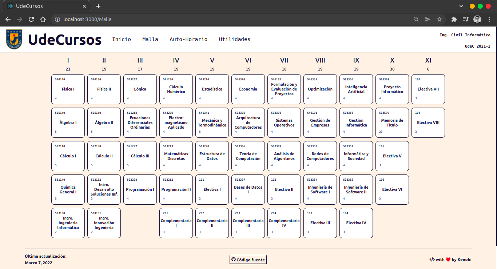

<p align="center">
  <h1 align="center">UdeCursos</h1>
  <p align="center">
    <a href="https://reactjs.org/">
      
    </a>
    <a href="https://redux.js.org/">
      
    </a>
    <a href="https://sass-lang.com/">
      
    </a>
    <a href="https://yarnpkg.com/">
      
    </a>
  </p>
</p>


---

> Check out the [beta here](https://udecursos.study/) or the **[latest build here!](http://build.udecursos.study/)** directly from the *dev branch*

🎒 Visual designed platform, bringing a modern and intuitive way to the courses management, for and by the students of the [Universidad de Concepción](https://admision.udec.cl/). Students can drag & drop their courses, visualize schedules and manage their grades.


---
## Screenshots
> Check out the responsive design as well! 👀
> Pre-release views 





## Getting started for devs!
1. Fork or clone the repo and install node modules:
```bash
yarn install
```

2. Run the app:
```bash
yarn start
```

3. Open the browser and go to http://localhost:3000/

4. Happy coding!
Don't forget to star the repo and submit your pull requests!

---

#### Built as my final project in my Front-End Engineer Path at:

<a href="https://codecademy.com/">
  
</a>

## License
[MIT](LICENSE)
