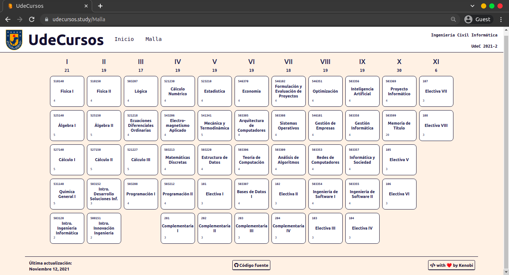

# UdeCursos

> In process open-source web app, check out the [pre-release here](https://udecursos.study/)

## Screenshots
> Pre-release views of the Drag & Drop Feature

## Getting started for devs! 
1. Go inside the repo and run `yarn install` in order to get all the dependencies
2. Now run the app with `yarn start``to start the development server

## License
[MIT](LICENSE)
